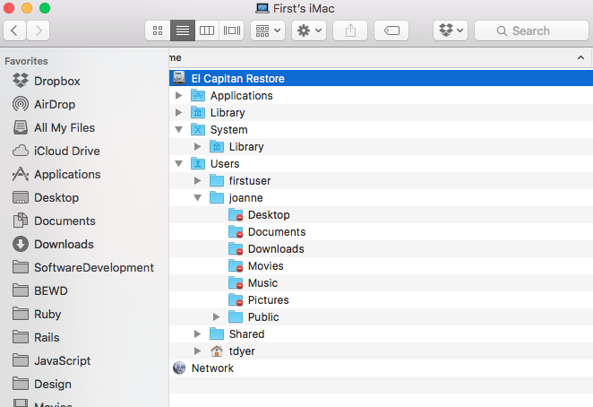

## Objectives

* Create a project.
* Create directories to organize a project.
* Create files to contain project information.
* Edit and Remove files.
* Explore and Navigate through the Unix Filesystem.

## Overview

I'm gonna tell a story about an conversation I had with an old school mate, Morty. And we're going to learn some Unix commands while helping out Morty.

Morty has owned a hardware store forever and he needs to get a hold of the management of this store using software. We'll at least he needs to create, read update and delete (__CRUD__) data about his store.


Now let's get onto the job of helping Morty out. Here's, pretty much, the start of the conversation I had with Morty about how we could use the __Unix__ operating system and it's __Filesystem__ to help manage the store.

> Tom: What are the departments in your store?

>> Morty: "Lawn and Garden", Plumbing, Electrical, Tools and Hardware.

> Tom: Ok, lets first create a project for your store.

## We Do (Yep, all of us)

### Open up the terminal.

This will bring up the command line interface (CLI) we can work in. We'll be typing Unix commands and viewing our project.

* We can click in the magnifying glass in the upper-right side of window, in the menu up there. Then type terminal and hit return.

* Alternatively, you can type 'Cmd-Space' to bring up Spotlight search. Then type terminal and hit return.


#### Create a directory, aka folder, for this project.

*(Note: the command to type will be preceded by the `$` character.)*

* Go to our home directory.  
	We'll use the `cd`, change directory, command by 	itself to go to our __home directory__.

	```bash
	$ cd
	```

	And we'll use the `pwd`, print working directory, 	command to check which directory we're in.

	```bash
	$ pwd
	/Users/tdyer
	```

	We see that the working directory we are in `/Users/tdyer`. But, what does this mean?

##### Definition: Filesystem
The computer filesystem consists of all the directories and files on that computer. These directories and files are organized in a __hierarchical manner__.



Here we see that the __root__ of the filesystem is "El Capitian Restore". Yours may be named "Machintosh HD".

##### Definition: Root directory
Is the top level directory in the tree structure that makes up your project or the **file system**.

##### Definition: Absolute path
An absolute path shows the location of a file or directory within the system's filesystem hierarchy.

A __path__ is just a representation of where a file or directory is located with the system's filesystem hierarchy. 

Absolute paths:  

* Always start with a leading slash, '/'
* Are relative to the root directory of the file system.

## You Do.
* Open up the Finder and go to the root directory of your filesystem.

* Find your home directory in the filesystem. 
	_Hint: use the absolute file path returned from the pwd above to find this._

## We Do.

### Create a project.

> We're going to **make a directory, mkdir,** in our home directory that will contain all the files, directories, etc. for this project.

```bash
$ pwd
/Users/tdyer
$ mkdir MortStore
```

> This will make a directory named "MortStore" in my home directory. See **mkdir is the make directory command**, amazing!

> Lets change into the "root", or top directory of your project. **Not the root of the filesystem, the root of this new project**.

```bash
$ cd MortStore
```

> This will **change directory, cd** into the MortStore directory. This directory will hold all the files and such for your project.

> Let's see what the contents of this directory are.

```bash
$ ls
```

> This will **list, ls,** all the files and subdirectories in the MortStore directory. None yet.

> Let's create a README file that will be a high level description of this project.

```bash
$ touch README
```

> This will **create an empty file, using touch,** that will be named README if one doesn't already  exist.

> Let's look at all the files our project, only the empty README right now.

```bash
$ ls
README
$ ls -l
-rw-r--r--  1 tdyer  staff  0 Sep 25 01:55 README
```
> **ls -l will list** the contents of the current directory in "long" form. 
> 
> It shows the permissions to the files and directories, *-rw-r--r--*. Followed by number of links, *1*, the owner name, *tdyer* , the group name, *staff* , the number of bytes in file, *0* and the last modified date/time.

### Add Project features

From here on we are going to use BOTH the command line and the Sublime text editor to view the project and modify the project.

> Open the project up in Sublime

```
$ pwd
/Users/tdyer/MortStore
$ 
$ subl .
```

> This will open the Sublime Text Editor for the  project in this current directory. 

##### Definition: Hidden files and directories.

Often we don't want to concern non-developers with certain files. These are called __hidden files__. 

These files start with a dot, `.`, before their name. And they are not seen by typical commands or in the Finder/Explorer file display.

But, we can see them. 

```bash
$ cd 
/Users/tdyer
$
$ls -al
. 
..
.bash_profile
.bashrc
$ 
```


##### Definition: The dot, '.' and dotdot, '..' directories.

Notice that when we view the contents of any directory with **ls -al** we view all the files, including hidden files.
The dot directory, `.`, is just another way to refer to the current directory and the dotdot directory, `..` is another way to refer to the current directory's parent directory.

> Let's make sure we are in the MortStore directory inside the tdyer directory inside the Users directory.

```bash
cd /Users/tdyer/MortStore
```

> Add the below text to to the README file and save it using Sublime.

```
Morty's Hardware
Lawn and Garden - Patio furniture, Hoses, Rakes, Shovels.
Plumbing - Toilets, Sinks, Tube and Showers, Pipes, Fittings, Solder
Electrical - Fuses, Lighting, Batteries, Switches, Wiring.
Tools - Hand Tools, Power Tools, Wet/Dry Vacuums, Work Benches.
Hardware - Door and Window, Fasteners.
```

> Go back to the Terminal and show the contents of the root directory.

```bash
$ pwd
$ ls
$ ls -l
-rw-r--r--  1 tdyer  staff  306 Sep 25 02:18 README
$ cat README
```
> **cat will print the contents of the file** README. This is just to check that you modified the right file in Sublime. *Sometimes we get confused about which file we're editing*.

**Create department directories.**

> Create subdirectories for each department.

```bash
$ mkdir LawnGarden
$ mkdir Plumbing
$ mkdir Electrical
$ mkdir Tools
$ mkdir Hardware
```

> View all files in your project, recursively

```bash
$ ls -lR
```

> -R will recurse through all the subdirectories and run ls -l to show
    all the files and subdirectories of the current directory.

> Determine that the view your seeing from ls -lR EXACTLY matches with the view of your project your seeing in Sublime.

**Create inventory files.**

> In Sublime, create a file that will track the inventory for each department.

> The files will be named inventory.txt and there contents will be a comma seperated file (CSV) in each department's directory.

> In LawnGarden/inventory.csv add:

```
Item,ProdNum,Quantity,Price,Sold Per Month
Shovel, 1, 11,74.33,13
Rake,2,5,35.99,0.5
Hose,3,19,16.99,3
```

> In Plumbing/inventory.csv:

```
Item,ProdNum,Quantity,Price,Sold Per Month
Toilet,4,3,249.99,1
Solder,5,88,5.99,33
Sinks,6,5,299.99,.2
```

> In Electrical/inventory.csv:

```
Item,ProdNum,Quantity,Price,Sold Per Month
Fuses,7,1024,1.99,640
Batteries,8,100,4.99,204
Switchs,9,29,14.50,18
```

> In Tools/inventory.csv:

```
Item,ProdNum,Quantity,Price,Sold Per Month
Hand Saw,10,9,77.99,2
Drill,11,67,34.99,15
Wet Vac,12,2,114.50,0.1
```

**Create department staff files.**

> Now create a file in each directory that will capture the current employees working in each department.

> In LawnGarden/staff.csv:

```
Name,Phone,Email,Role
Jack Sprat,978-251-2384,jack@example.com,manager
Moe Brown,617-589-8977,moeb@example.com, associate
```

> In Plubming/staff.csv:

```
Name,Phone,Email,Role
Brian Behan,978-668-2344,brianb@example.com,manager
Richy Havens,617-812-7312,rhavens@example.com, associate
```

> In Electrical/staff.csv:

```
Name,Phone,Email,Role
Joy Gillis,978-238-9894,joyg@example.com,manager
Laura Havens,617-763-5542,rhavens@example.com, associate
```

> In staff.csv:

```
Name,Phone,Email,Role
Tom Smith,888-989-777,ts@example.com, associate
Meg Brown,978-453-8984,megb@example.com,manager
```

> Run ls -R and check it against the structure of your project shown in Sublime. Should be the same.

> Oops, looks like the last staff file we created was in the root of the directory. Lets move it into the Tools directory.

```bash
$ pwd 
$ mv staff.csv Tools/.
```

> We are using the **move** command. The dot after the directory just indicates that the destination file should also be named inventory.csv.

**Create department notice files.**

> Create a notice.txt file in each directory to communicate with the employees in each department.

```bash
$ pwd (Make sure your in the project root dir)
$ touch notice.txt
$ mv notice.txt Tools/.
$ cp Tools/notice.txt Electrical/.
$ cp Tools/notice.txt Plumbing/read_this.txt 
$
```
> Here we using the **copy unix command, cp**. 

**Create products file**

> Let's create a file that will contain product information. 

```bash
touch products.csv
```

> Use Sublime to add these products, just cut and paste here.
```
Lawn and Garden - Patio furniture, Hoses, Rakes, Shovels.
Plumbing - Toilets, Sinks, Tube and Showers, Pipes, Fittings, Solder
Electrical - Fuses, Lighting, Batteries, Switches, Wiring.
Tools - Hand Tools, Power Tools, Wet/Dry Vacuums, Work Benches.
Hardware - Door and Window, Fasteners.
```

> Oh, nevermind. Don't like how this is done lets **remove** the file.

```bash
rm products.csv
```


## You Do

Create a cheat sheet of the unix commands that we've used so far. *I like to these kinds of files for reference.*

I want each of you to describe each command **in your own words**. Don't just cut and paste from some definition on the web!

Use whatever system that works for you, Evernote, plain text files (my favorite), tatoos, whatever.

**Show the final version to an instructor or DIR**

## We do

**Search for a term**

> I'm looking for the phone number for an employee named Tom. I'm not sure what his last name is or what department he works in?

```
$ grep -R Tom *
$ grep -R Tom */*.csv
$ grep -R Tom */staff*
```

> I'm using grep to search for Tom. First I'm going to search for Tom in every file recursively in my project using ``grep -R Tom *``. Then I'm going to only look in CSV files. Finally, I'm going to look only in files that start with the characters 'staff'.
> 
> Notice the '*'. This is something called a Regular Expression, aka regex. You can think of it as a kind of wild card. *We'll learn more about this later.*

**Search for a file**

> Ok now I want to find all the staff CSV files in my project.

```bash
$ pwd (Make sure your in the project root dir)
$ find . -name '*.csv'
```

> **find** is a pretty useful command that will allow one to find a file by name, partial name, modified or creation date. *It has many options that can be it complex but very useful*

> This will look for any file that ends in .csv in the current directory and all descendent directories.

> Look for these files in Sublime using it's file search features.


### Finally
Morty has been unusually quite, but now he speaks up.

>> Wow, this is crazy. Man, ls, cp, rm, mkdir, touch I'll never remember all this stuff!

> That's right Morty. Just.

```bash
$ man ls
$
$ man cp
$ man find
```

> Just use the **manual command, man** to find more info!. You can even.
> 

```bash
man man
```

## You Do

Create a project to track song information for a record company. 

The songs should be grouped by genre. Let's say Rock, Jazz, Blues and  Dubstep. Yes, you will need to create directories for each genre.

Create between one and four files in these directories, using ``touch``, where each file will contain the following infomation about one song. 

> Title, Song Duration (Minutes), Price (dollars), Artist Name.

Create a couple of songs in each file.


Use ``mv`` to move a song file from Rock to some other directory. 

Use ``cp`` followed by ``rm`` to move a file from Dubstep to Blues.

Change into each directory and use ``ls`` and ``ls -al`` to view all the files in the directory.

Change into the root directory and use ``ls -alR`` to view all the files in the project.

For each of the above commands, (mv, cp, rm, touch), perform the equivalent operation in Sublime.

### References

[Teaching Unix](http://www.ee.surrey.ac.uk/Teaching/Unix/)

[Unix Cheat Sheet](https://www.rain.org/~mkummel/unix.html)

[Unix Power Tools](http://shop.oreilly.com/product/9780596003302.do)


